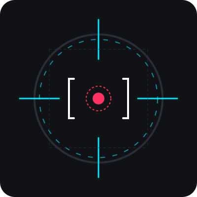

<div align="center">
  
  <h1>SniperAgent-Logging</h1>
  <p>Automated log analysis — Docker + PFsense → LLM → Gotify</p>
  <p>
    <a href="https://hub.docker.com/r/dungfu/sniper-agent-logging">
      
    </a>
    <a href="https://hub.docker.com/r/dungfu/sniper-agent-logging">
      
    </a>
    <a href="https://github.com/fireph/SniperAgent-Logging/actions">
      
    </a>
  </p>
</div>

---

Automated log analysis agent that monitors Docker container logs and PFsense syslog, uses an LLM to identify issues worth acting on, and pushes alerts to Gotify with severity-based priority.

## How It Works

```
 PFsense ──── UDP :1514 ─────┐
                             ├──► Vector ──► /data/logs/*.jsonl
 Docker containers ── socket ┘                │
                                              ▼
                                         Sniper Agent
                                              │
                                   ┌──────────┼──────────┐
                                   │          │          │
                           reads logs   reads context   sends alerts
                                   │          │          │
                                   ▼          ▼          ▼
                         LLM analysis     context.md    Gotify
```

1. **Vector** collects logs from Docker (via socket) and PFsense (via UDP syslog on port 1514), tags the source, and writes daily JSONL files to `/data/logs/`
2. **Sniper** runs on a configurable interval (default 12 hours), reads new log entries since the last scan, and sends them to an LLM for analysis
3. The LLM classifies any issues by severity and returns structured JSON
4. Each issue triggers a Gotify notification with priority mapped to severity

## Severity & Gotify Priority

| Severity | Gotify Priority | Meaning |
|----------|----------------|---------|
| info     | 1              | Informational, no action needed |
| low      | 3              | Minor, can wait |
| medium   | 5              | Moderate, address soon |
| high     | 8              | Significant, needs prompt attention |
| urgent   | 10             | Critical, immediate action required |

## Context File

`./data/context.md` is a plain markdown file you edit manually to control the agent's behavior. It has two sections:

- **Ignore** — list issues you don't want notified about (e.g. known false positives)
- **Notes** — environment details so the LLM knows what's normal

The file is mounted from the persistent data volume, so edits persist across container restarts. Example:

```markdown
# Sniper Context

## Ignore

- certbot renewal failures on port 80 are expected during off-hours
- pfsense gateway alarm on WAN1 is a known ISP issue

## Notes

- Home lab runs on TrueNAS Scale
- Docker host is the same machine as the log collector
- PFsense is the edge firewall/gateway
```

## MCP Tools

The agent exposes a FastMCP server internally on `127.0.0.1:8080` (not exposed to the host):

- `analyze_logs` — manually trigger a log scan
- `read_context` — read the current context.md

## Deployment

### Prerequisites

- Docker + Docker Compose
- A Gotify instance with an app token
- An LLM API key (uses [synthetic.new](https://synthetic.new) by default)

### Setup

1. Copy `.env.example` to `.env` and fill in your values:

```bash
cp .env.example .env
```

2. Create the data directory and seed the context file:

```bash
mkdir -p data/logs
cp context.md data/context.md
```

3. Start the stack:

```bash
docker compose up -d
```

4. Point your PFsense syslog at `<host>:1514/UDP`

### Environment Variables

| Variable | Default | Description |
|----------|---------|-------------|
| `LLM_BASE_URL` | `https://api.synthetic.new/openai/v1` | LLM API base URL |
| `LLM_API_KEY` | (required) | API key for the LLM provider |
| `LLM_MODEL` | `syn:small:text` | Model name to use |
| `GOTIFY_URL` | (required) | Gotify server URL |
| `GOTIFY_TOKEN` | (required) | Gotify app token |
| `SCAN_INTERVAL_HOURS` | `12` | Hours between automated scans |
| `LOG_DIR` | `/data/logs` | Path to JSONL log files |
| `CONTEXT_FILE` | `/data/context.md` | Path to context markdown |
| `LAST_SCAN_FILE` | `/data/.last_scan` | Timestamp of last scan |

### CI/CD

Pushes to `main` automatically build and push `dungfu/sniper-agent-logging:latest` to DockerHub via GitHub Actions. Set these repository secrets:

- `DOCKERHUB_USERNAME`
- `DOCKERHUB_TOKEN`

## File Structure

```
├── .github/workflows/docker.yml   CI/CD pipeline
├── .env.example                   Environment template
├── context.md                     Default context file (seed into data/)
├── docker-compose.yml             Vector + Sniper
├── Dockerfile                     Python 3.14, fastmcp/openai/httpx
├── pyproject.toml                 Project metadata & dependencies
├── vector/
│   └── vector.yaml                Vector config: Docker + PFsense -> JSONL
└── src/sniper/
    ├── __init__.py
    ├── main.py                    Entry point: scheduler + MCP server
    ├── agent.py                   FastMCP tools, LLM analysis, notification logic
    ├── config.py                  Environment-based configuration
    ├── context.py                 Reads context.md
    └── notifier.py                Gotify push with severity->priority mapping
```
